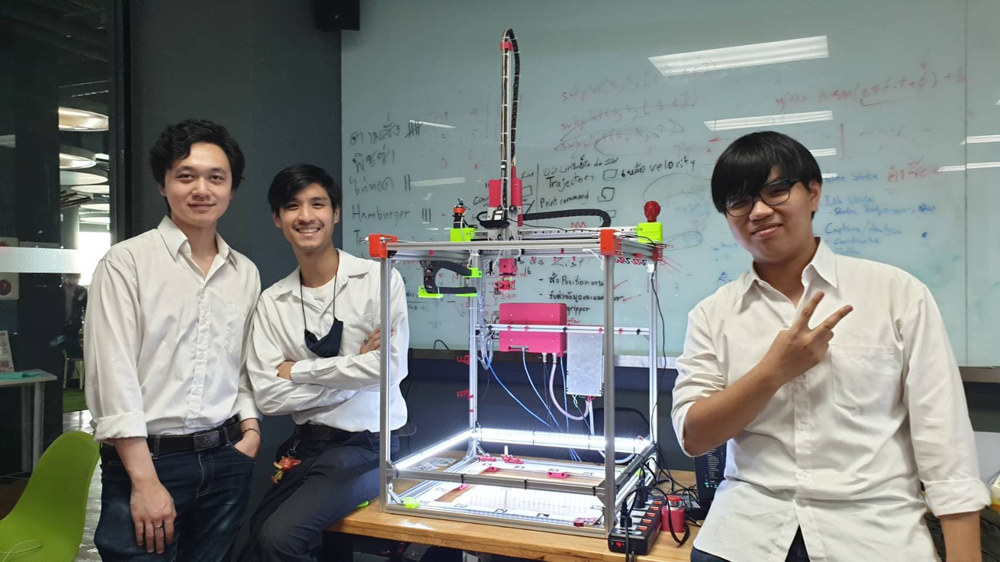
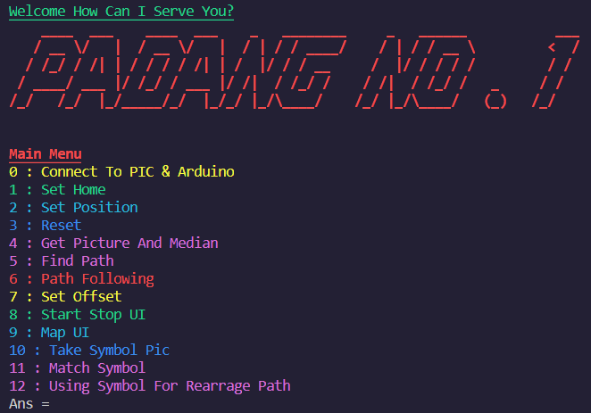
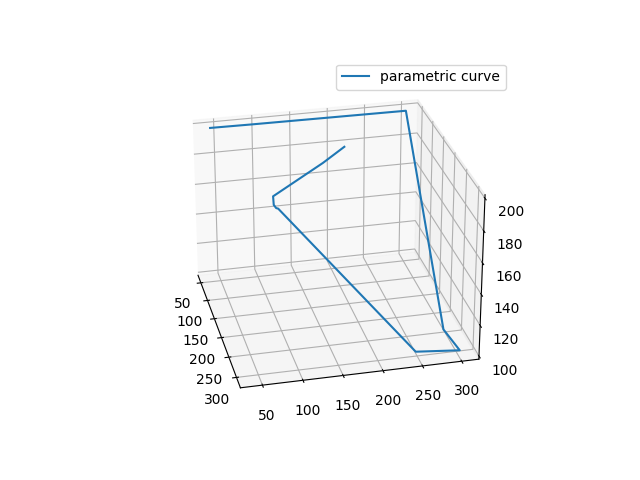

# AuntieRed
 This part of the code is only high level code (image processing & serial communication) for controlling a cartesian robot at FIBO module 67.
 In order to run this robot pls run main.py to control the robot

## Menu

## Generated Path

## Report
https://mailkmuttacth-my.sharepoint.com/:u:/g/personal/kittitouch_fame_mail_kmutt_ac_th/ETYPcK6GZG1JhfAGEDo3XioB9BOWlVtAqEYbEmy4R6SYWQ?e=ywIbBP
## Requirement
In Order To Run This Files You Need
```
 args=0.1.0=pypi_0
 arrow=0.17.0=pypi_0
 ca-certificates=2020.11.8=h5b45459_0
 certifi=2020.11.8=py38haa244fe_0
 chardet=3.0.4=pypi_0
 click=7.1.2=pypi_0
 clint=0.5.1=pypi_0
 cycler=0.10.0=pypi_0
 idna=2.10=pypi_0
 intel-openmp=2020.3=h57928b3_311
 kiwisolver=1.3.1=pypi_0
 lazyme=0.0.23=pypi_0
 libblas=3.8.0=21_mkl
 libcblas=3.8.0=21_mkl
 liblapack=3.8.0=21_mkl
 matplotlib=3.3.3=pypi_0
 mkl=2020.4=hb70f87d_311
 numpy=1.19.3=pypi_0
 opencv-contrib-python=4.4.0.46=pypi_0
 openssl=1.1.1h=he774522_0
 pillow=8.0.1=pypi_0
 pip=20.3=py38haa95532_0
 playsound=1.2.2=pypi_0
 pocket=0.3.6=pypi_0
 prompt-toolkit=1.0.14=pypi_0
 pyfiglet=0.8.post1=pypi_0
 pygments=2.7.2=pypi_0
 pyinquirer=1.0.3=pypi_0
 pyparsing=2.4.7=pypi_0
 pyserial=3.5=pypi_0
 pysocks=1.7.1=pypi_0
 python=3.8.5=h5fd99cc_1
 python-dateutil=2.8.1=pypi_0
 python_abi=3.8=1_cp38
 rainbowstream=1.5.2=pypi_0
 regex=2020.11.13=pypi_0
 requests=2.25.0=pypi_0
 setuptools=50.3.1=py38haa95532_1
 six=1.15.0=pypi_0
 sqlite=3.33.0=h2a8f88b_0
 twitter=1.18.0=pypi_0
 urllib3=1.26.2=pypi_0
 vc=14.1=h0510ff6_4
 vs2015_runtime=14.16.27012=hf0eaf9b_3
 wcwidth=0.2.5=pypi_0
 wheel=0.35.1=pyhd3eb1b0_0
 wincertstore=0.2=py38_0
 zlib=1.2.11=h62dcd97_4 
```
